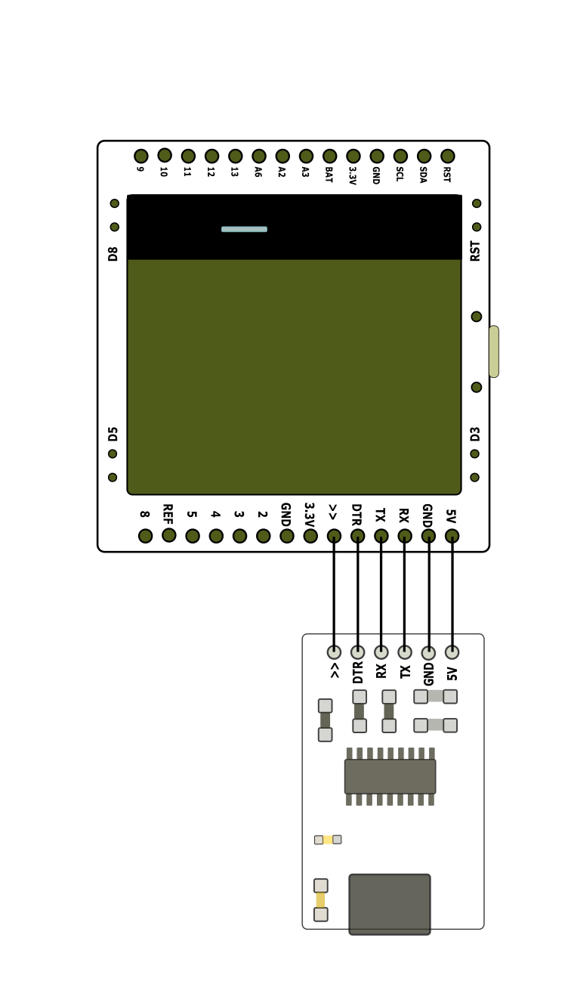

## What you get in the package
Typically you will receive a monoView and a programmer.

## First Power Up!
When you get your monoView, the first thing you need to do is to power the device via the micro USB port. When powered on, it will show an animation on the screen.

If you see the animation then congratulation! Your monoView is working!

## Connections
Make sure you connect the programmer and the monoView properly. Check twice before powering up.

If you connect the TX or RX pin to ground then the chip will be damaged.
## Install the library
Download the "U8g2" folder and copy it to the library folder of arduino.

The folder should look like this in the library folder.
## Select the board in Arduino# Flash the examples
## Buttons, SD card, Power Switch, SD card holder and the battery connector
## Clock and Watch Board
## Full size programmer
